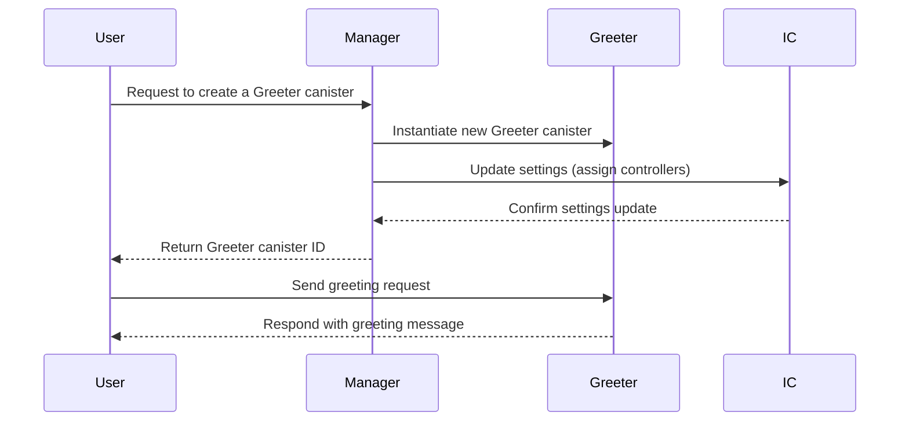

# **Dynamically Deploying Canisters**

This repository demonstrates how to **dynamically deploy canisters** in **Motoko** using a **Manager** canister. The Manager is responsible for **creating new Greeter canisters**, setting their **controllers**, and managing them.

## Overview

The **Manager canister** allows users to create new **Greeter** canisters dynamically. When a user calls `createGreeter`, the Manager:
1. **Creates a new Greeter canister**.
2. **Assigns the caller as a controller**.
3. **Updates the canister settings** using the **IC Management Canister**.

This approach enables **on-demand** canister deployment for multi-user applications.

---

## **Process Flow**



---

## How It Works
### 1. Deploying the Manager Canister
The **Manager** is deployed first, allowing users to request Greeter canisters.

### 2. Creating a New Greeter Canister
- A user calls `createGreeter()`, passing their **principal**.
- The Manager:
  1. Instantiates a Greeter canister.
  2. Adds it to its list of greeters.
  3. Retrieves the Greeter canister ID.
  4. Updates the settings to assign the caller as a controller.
  5. Returns the canister ID to the caller.

### **3. Interacting with the Greeter Canister**
- Users can interact with their Greeter canister by calling `greet(name)`, which returns a personalized greeting.

---


## Deployment Instructions
1. Deploy the Manager canister:
   ```sh
   dfx deploy dynamic_canister_deployment_backend
   ```

2. Create a new Greeter canister:
   ```sh
   dfx canister call dynamic_canister_deployment_backend createGreeter
   ```

3. Interact with the Greeter:
   ```sh
   dfx canister call <greeter_canister_id> greet '("Alice")'
   ```

---

## Security Considerations
- **Restricting Anonymous Calls:**  
  The `inspect` function ensures that anonymous calls are **rejected**.

- **Access Control:**  
  Each Greeter canister **only assigns control** to its creator.
